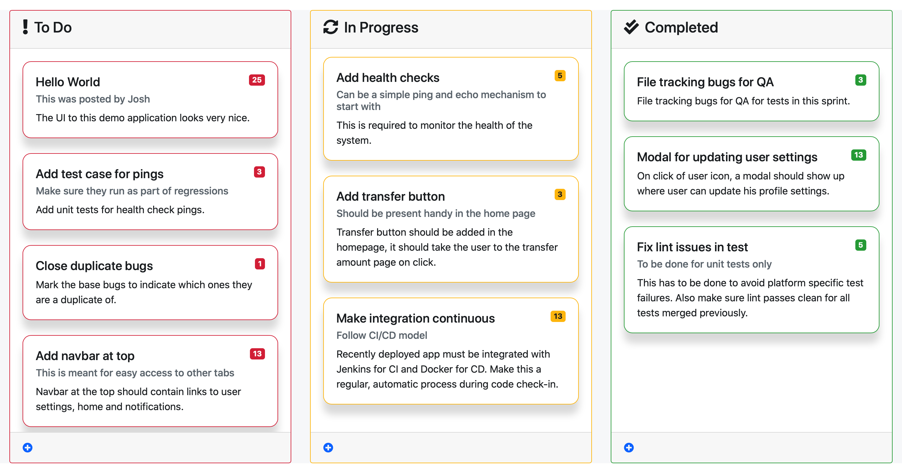

# Introduction
MuSprint is a web application designed to track sprint user stories on a story
board. Stories are organized into 'To Do', 'In Progress' or 'Completed'
category. Each story is assigned 'story points' to indicate the amount of
effort required to complete it. Using the web user interface, it is possible
to switch a story from one category to another. A story can be deleted or edited
too.

# Deployment View
Currently MuSprint application uses SERN stack. SERN stands for SODA-Express-
React-Node.js. Simple Oracle Document Access (aka SODA) is a set of NoSQL style
APIs to create and manage JSON document collections in Oracle Database. The
application runs against Autonomous JSON Database (AJD) instance.

For more info: [SODA](https://docs.oracle.com/en/database/oracle/simple-oracle-document-access/index.html) -  [Express](https://expressjs.com/) - [React](https://reactjs.org/) - [Node.js](https://nodejs.org/)

# References

* [SODA API](https://docs.oracle.com/en/database/oracle/simple-oracle-document-access/nodejs/index.html)  

* [SQL/JSON](https://docs.oracle.com/en/database/oracle/oracle-database/19/adjsn/index.html)

* [Autonomous JSON Database (AJD)](https://www.oracle.com/autonomous-database/autonomous-json-database/)  

# Installation Prerequisites
* Install Docker  
  [https://www.docker.com/]()

* Create Oracle Cloud account  
  [https://www.oracle.com/cloud/]()

* Create Autonmous JSON Database instance  
  [https://www.oracle.com/autonomous-database/autonomous-json-database/get-started/]()

* Download Wallet  
  [https://docs.oracle.com/en/cloud/paas/autonomous-data-warehouse-cloud/user/connect-download-wallet.html]()  
  [https://blogs.oracle.com/opal/how-connect-to-oracle-autonomous-cloud-databases]()

# Deployment Instructions

### 1 Update Profile Configuration File  

After the wallet is downloaded, edit `sqlnet.ora` and change the wallet location directory to the directory containing the `cwallet.sso` file:
~~~~
WALLET_LOCATION = (SOURCE = (METHOD = file) (METHOD_DATA = (DIRECTORY="/Users/sriksure/cloud/Wallet_MuSprintDB")))
SSL_SERVER_DN_MATCH=yes
~~~~

### 2 Download Source

* Download [MuSprint](MuSprint) project source, or
* Clone git repository:
  ~~~~
  git clone https://github.com/oracle/json-in-db.git
  ~~~~

### 3 Build and Run Docker Image

This involves deployment of a frontend server (React) and a backend server (Express + SODA).The following instructions are for running two standalone apps. Alternatively, you can also use [`docker compose`](https://docs.docker.com/compose/) for running multi-container Docker applications. 

#### 3.1 Deploying frontend server [Console - 1]

* Build `stories` docker image - This container would run express server and issue SODA calls to Oracle Database  
  Change directory to `stories` and build image:
  ~~~~
  cd <>/json-in-db/MuSprint/stories
  docker build -t musprint-stories:1.0.0 .
  ~~~~

* Run `stories` app
  ~~~~
  docker run -it \
             --env NODE_ORACLEDB_USER=<your_database_username> \
             --env NODE_ORACLEDB_PASSWORD=<your_database_password> \
             --env NODE_ORACLEDB_CONNECTIONSTRING=<your_service_name> \
             --volume <your_path_to_wallet>:<your_path_to_wallet> \
             --env TNS_ADMIN=<your_path_to_wallet> \
             -p 5000:5000 \
             musprint-stories:1.0.0
  ~~~~
  This will start a listener on port 5000.  
  Note:   
  * **`<your_database_username>`**
    * Database user you want to use.
    * `ADMIN` is default when you create an instance.
  * **`<your_database_password>`**
    * Password for the database user.
  * **`<your_service_name>`**
    * One of the network service name entries in tnsnames.ora file in your wallet directory.
    * The first entry would be like the following. In this example, `musprintdb_high` is the service name.
      ~~~~
      musprintdb_high = (description= (retry_count=20)(retry_delay=3)(address=(protocol=tcps)(port=1522)(host=adb.us-sanjose-1.oraclecloud.com))(connect_data=(service_name=b4fzgvhdqfdosn8_musprintdb_high.adb.oraclecloud.com))(security=(ssl_server_cert_dn="CN=adb.us-sanjose-1.oraclecloud.com,OU=Oracle ADB SANJOSE,O=Oracle Corporation,L=Redwood City,ST=California,C=US")))
      ~~~~
  * **`<your_path_to_wallet>`**
    * Absolute path of your wallet directory as specified in `sqlnet.ora`.
    * The same path will be used inside the docker container too.

#### 3.2 Deploying backend server [Console - 2]

* Build `client` docker image  
  Change directory to `client` and build image:
  ~~~~
  cd <>/json-in-db/MuSprint/client
  docker build -t musprint-client:1.0.0 .
  ~~~~

* Run client app  
  ~~~~
  docker run -it \
             -p 3000:3000 \
             musprint-client:1.0.0
  ~~~~
  This will start a listener on port 3000.  

The application is ready to view on a browser:  http://localhost:3000/
